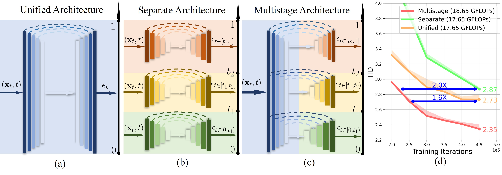

# Improving Training Efficiency of Diffusion Models via Multi-Stage Framework and Tailored Multi-Decoder Architecture

[Huijie Zhang*](https://www.huijiezh.com/), [Yifu Lu*](https://scholar.google.com/citations?user=ybsmKpsAAAAJ&hl=en), [Ismail Alkhouri](https://sites.google.com/view/ismailalkhouri/about), [Saiprasad Ravishankar](https://sites.google.com/site/sairavishankar3/home), [Dogyoon Song](https://sites.google.com/view/dogyoonsong/home), [Qing Qu](https://qingqu.engin.umich.edu/).

[Paper](https://openaccess.thecvf.com/content/CVPR2024/papers/Zhang_Improving_Training_Efficiency_of_Diffusion_Models_via_Multi-Stage_Framework_and_CVPR_2024_paper.pdf) | [arXiv](https://arxiv.org/abs/2312.09181) | [Website](https://www.huijiezh.com/multistage-diffusion-model/)




**Abstract**. 
> Diffusion models, emerging as powerful deep generative tools, excel in various applications. They operate through a two-steps process: introducing noise into training samples and then employing a model to convert random noise into new samples (e.g., images). However, their remarkable generative performance is hindered by slow training and sampling. This is due to the necessity of tracking extensive forward and reverse diffusion trajectories, and employing a large model with numerous parameters across multiple timesteps (i.e., noise levels).
To tackle these challenges, we present a multi-stage framework inspired by our empirical findings. These observations indicate the advantages of employing distinct parameters tailored to each timestep while retaining universal parameters shared across all time steps. Our approach involves segmenting the time interval into multiple stages where we employ custom multi-decoder U-net architecture that blends time-dependent models with a universally shared encoder. Our framework enables the efficient distribution of computational resources and mitigates inter-stage interference, which substantially improves training efficiency. 
Extensive numerical experiments affirm the effectiveness of our framework, showcasing significant training and sampling efficiency enhancements on three state-of-the-art diffusion models, including large-scale latent diffusion models. Furthermore, our ablation studies illustrate the impact of two important components in our framework: (i) a novel timestep clustering algorithm for stage division, and (ii) an innovative multi-decoder U-net architecture, seamlessly integrating universal and customized hyperparameters.

This repository is based on [DPM-solver](https://github.com/LuChengTHU/dpm-solver), [EDM](https://github.com/NVlabs/edm) and [LDM](https://github.com/CompVis/latent-diffusion). We adding the multistage strategy to both of this three repositories. For the following sections, we provide detailed instructions for running each architecture. 

## Pretrained model

All models mentioned in the paper could be downloaded [here](https://drive.google.com/drive/folders/1Zo3ZUTOgLaaPW7E5GeXuBwIoYjS2VDWv?usp=drive_link), including multistage-dpm-solver for CIFAR-10 dataset, multistage-edm for CIFAR-10 and CelebA dataset, multistage-ldm for CelebA dataset.

## DPM-Solver

### Requirements

### Training

### Evaluation

## EDM

### Requirements

```sh
conda env create -f edm/environment.yml -n multistage-edm
conda activate multistage-edm
```

### Preparing dataset

For training and evaluation dataset preparation, please go to [preparing dataset of EDM](https://github.com/NVlabs/edm?tab=readme-ov-file#preparing-datasets).

### Training

```sh
# Train DDPM++ model for unconditional CIFAR-10 using 4 GPUs
cd edm
torchrun --standalone --nproc_per_node=4 train.py --outdir=../training-runs --data=../dataset/cifar10-32x32.zip --cond=0 --arch=ddpmpp-multistage --batch=128
```

### Evaluation

```sh
# evaluate multistage-edm on CelebA dataset
cd edm
torchrun --standalone --nproc_per_node=1 generate.py --outdir=../fid-tmp --seeds=00000-49999 --network=../model/multistage_edm_celeba.pkl --batch=512

torchrun --standalone --nproc_per_node=1 fid.py calc --images=../fid-tmp --ref=../dataset/celebA_32_edm_fid.npz

# evaluate multistage-edm on CIFAR-10 dataset
cd edm
torchrun --standalone --nproc_per_node=1 generate.py --outdir=../fid-tmp --seeds=00000-49999 --network=../model/multistage_edm_cifar10.pkl --batch=512

torchrun --standalone --nproc_per_node=1 fid.py calc --images=../fid-tmp --ref=../dataset/cifar10-fid.npz
```

## LDM

### Requirements

### Training

### Evaluation

## Citation

```
@inproceedings{multistage,
title={Improving Training Efficiency of Diffusion Models via Multi-Stage Framework and Tailored Multi-Decoder Architectures},
author={Zhang, Huijie and Lu, Yifu and Alkhouri, Ismail and Ravishankar, Saiprasad and Song, Dogyoon and Qu, Qing},
booktitle={Conference on Computer Vision and Pattern Recognition 2024},
year={2024},
url={https://openreview.net/forum?id=YtptmpZQOg}
}
```

## Acknowlegements

This repository is based on [LuChengTHU/dpm-solver](https://github.com/LuChengTHU/dpm-solver), [NVlabs/edm](https://github.com/NVlabs/edm) and [CompVis/latent-diffusion](https://github.com/CompVis/latent-diffusion). 
